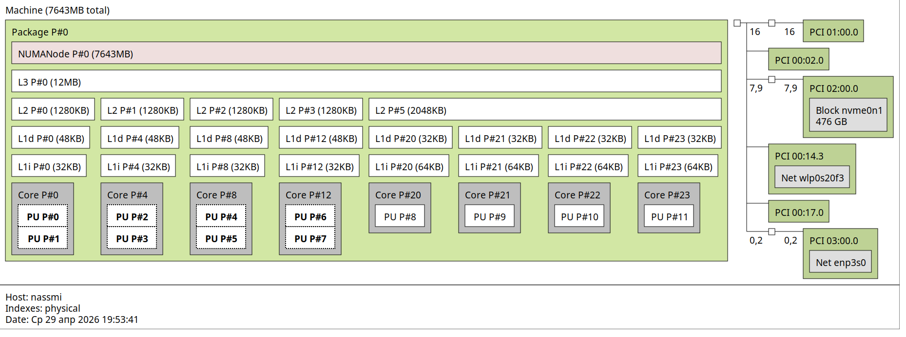
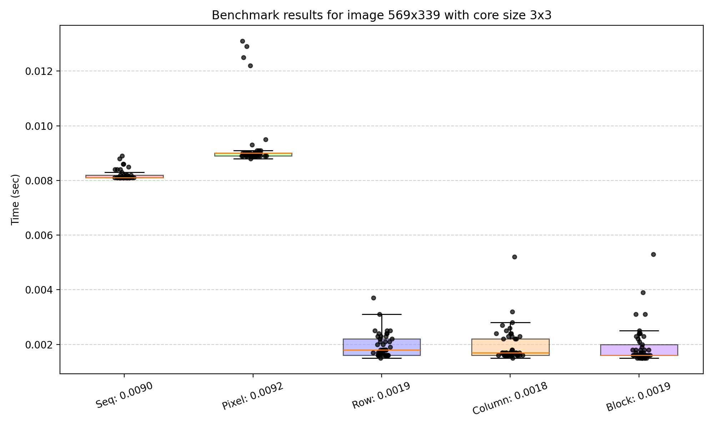
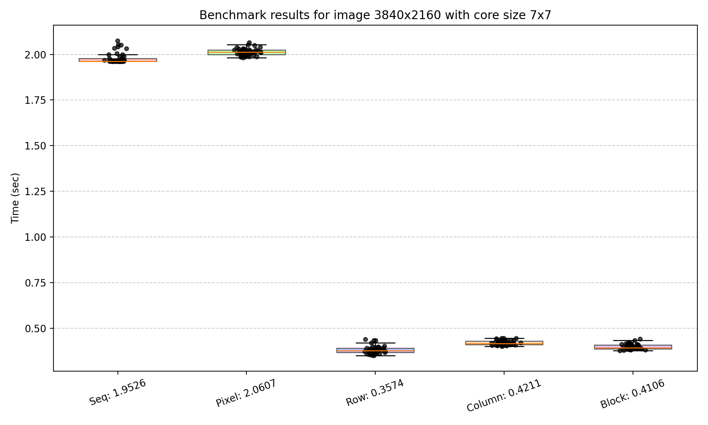
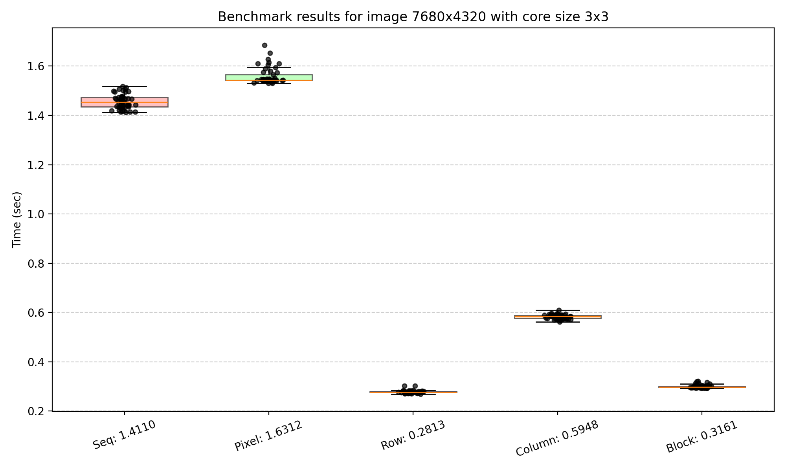

# Conv
Apply convolution filters (blur, sharpen, edge detection, etc.) to images
## Usage
```
conv --input=<input_file> --filter=<filter> --size=<size> --mode=<mode> [--clean]
```
_The utility has no required arguments. All settings are optional and have default values._

#### Options
| Option | Default | Possible values |
|--------|---------|-----------------|
| `--input` | First image in `./images` directory | Name of image file inside `./images` (e.g., `photo.jpg`) |
| `--filter` | `blur` | `blur`, `sharpen`, `edge`, `emboss`, `motion` |
| `--size` | `3` | Any odd number from 3 to 13 |
| `--mode` | `seq` | `seq`, `pixel`, `row`, `column`, `block` |

#### Flags

| Flag | Description |
|------|-------------|
| `--clean`, `-c` | Remove all files from the `./output` directory before writing new results |
| `--help`, `-h` | Print help information with all available options and flags |

## Quick Start

### Build and run conv

```bash
cd ./build
cmake ..
make build
./conv
```
### Run benchmarks
```bash
# inside ./build after cmake ..
make bench
```
### Run tests
```bash
# inside ./build after cmake ..png
make test
```
## Benchmarks
### Cache configuration
<p align="center">
  
  <br>
  <em>The benchmarks were conducted on the following system:</em>
</p>

### Benchmark results

#### Bench 1
<p align="center">
  
  <br>
  <em>Small image + small core</em>
</p>

#### Bench 2
<p align="center">
  
  <br>
  <em>Medium image + medium core</em>
</p>

#### Bench 3
<p align="center">
  
  <br>
  <em>Big image + small core</em>
</p>

### Conclusions
